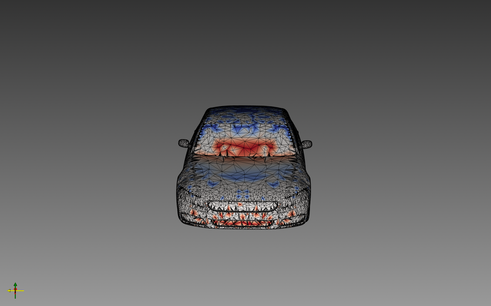
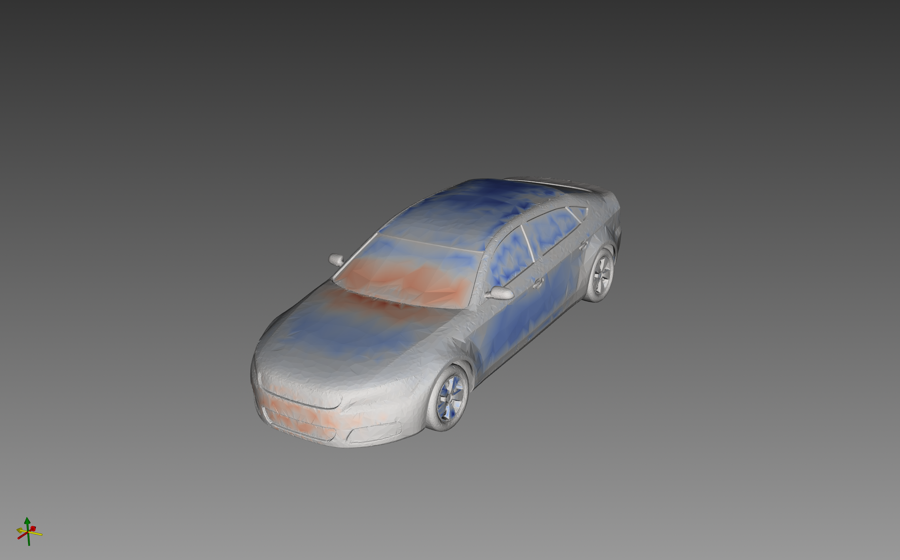
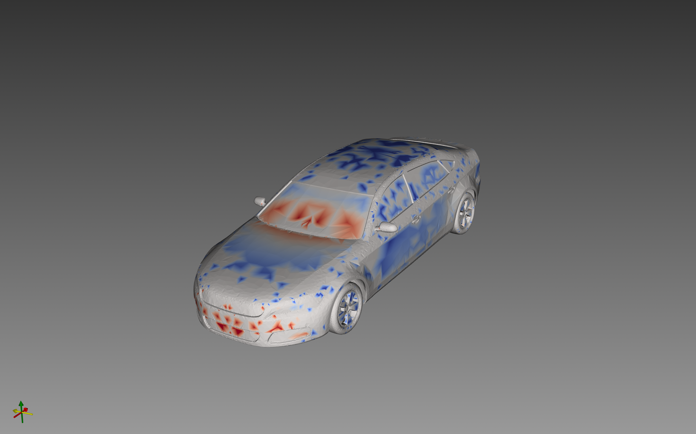
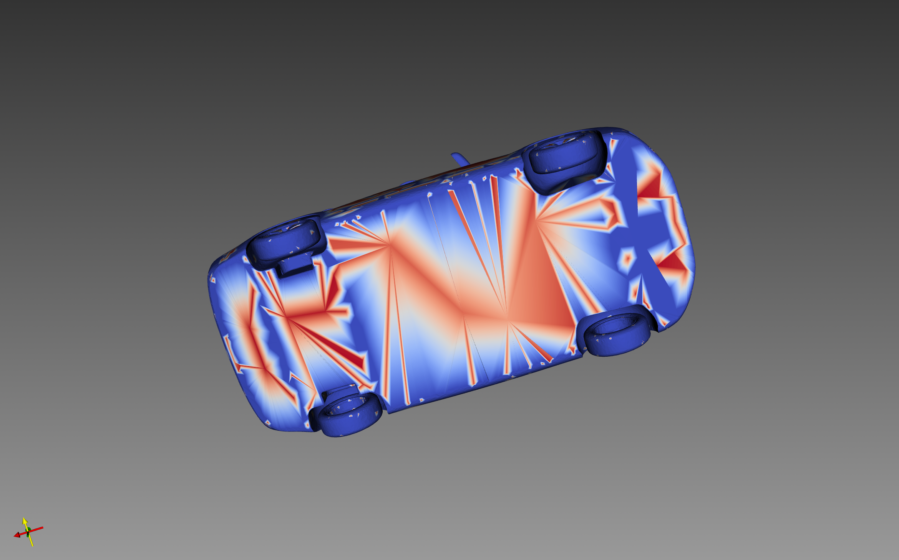
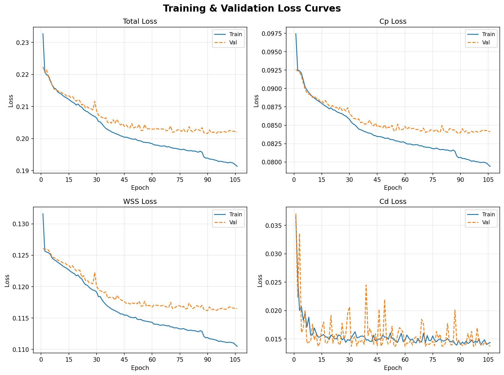

<div align="center">

<br/>

```
███████╗ ██╗   █████╗ ███████╗██████╗  ██████╗ ███╗  ██╗███████╗████████╗
██╔════╝███║  ██╔══██╗██╔════╝██╔══██╗██╔═══██╗████╗ ██║██╔════╝╚══██╔══╝
█████╗  ╚██║  ███████║█████╗  ██████╔╝██║   ██║██╔██╗██║█████╗     ██║   
██╔══╝   ██║  ██╔══██║██╔══╝  ██╔══██╗██║   ██║██║╚████║██╔══╝     ██║   
 ██║      ██║  ██║  ██║███████╗██║  ██║╚██████╔╝██║ ╚███║███████╗   ██║    
```

### **Gauge Equivariant Mesh CNNs for Aerodynamic Field Prediction**
*Predicting CFD outputs on 3D car meshes — without solving Navier-Stokes*
*F1AeroNet is named after Formula 1 racing, where aerodynamic performance 
is the decisive engineering frontier — the same surface pressure and drag 
fields this model predicts are what F1 teams simulate thousands of times 
per season to find fractions of a second.*

<br/>

[](https://python.org)
[](https://pytorch.org)
[](https://pyg.org)
[](LICENSE)
[](https://github.com/Mohamedelrefaie/DrivAerNet)

<br/>





<br/>

</div>

---

## ⚡ What is F1AeroNet?

**F1AeroNet** is a geometric deep learning surrogate model that predicts **full aerodynamic field distributions** over 3D car surfaces — directly from the mesh geometry — replacing hours of CFD simulation with a **sub-second forward pass**.

It is built on **Gauge Equivariant Mesh CNNs (GEM-CNN)**, a class of geometric neural networks that apply *anisotropic, direction-aware convolutions* on curved mesh surfaces. Unlike standard Graph Neural Networks, F1AeroNet knows which direction each mesh neighbour points — making it sensitive to flow direction, surface curvature, and the orientation of aerodynamic features.

```
Standard GCN    →   isotropic kernel   →   cannot distinguish leading edge from trailing edge
F1AeroNet       →   anisotropic kernel →   direction-aware, gauge-equivariant, physically consistent
```

---

## 🎯 Outputs

| Field | Symbol | Type | Physical Meaning |
|-------|--------|------|-----------------|
| **Pressure Coefficient** | Cp | ρ₀ scalar | Surface pressure distribution — stagnation zones, suction peaks, separation |
| **Wall Shear Stress** | WSS | ρ₁ tangent vector | Viscous skin friction direction and magnitude |
| **Drag Coefficient** | Cd | ρ₀ scalar | Integrated aerodynamic resistance |

> **Key insight:** Output types are not a design choice — they are enforced by representation theory. Cp is a gauge-invariant scalar (ρ₀); WSS is a gauge-equivariant tangent vector (ρ₁). The network *cannot* produce a physically inconsistent prediction.

---

## 🖼️ Results

### Pressure Coefficient — Cp Field

<!-- CP COMPARISON PLACEHOLDER -->
> 📸 **[INSERT: Side-by-side comparison — Left: F1AeroNet predicted Cp | Right: OpenFOAM ground truth. Suggested layout: two images of equal size, ~700×400px each, separated by a thin divider. Label each panel.]**


| Predicted | Ground Truth |
|:---------:|:------------:|
|  |  |


<br/>

### Wall Shear Stress — WSS Vector Field Magnitude





<br/>

### Training Convergence





<br/>

### Quantitative Results

| Metric | Value |
|--------|-------|
| Cp MAE | `[INSERT]` |
| Cp R² | `[INSERT]` |
| WSS MAE | `[INSERT]` |
| Cd L1 Error | `[INSERT]` |
| Cd Relative Error | `[INSERT] %` |
| Training Meshes | 200 |
| Validation Meshes | 20 |
| Total Parameters | ~138k |

---

## 🧮 Mathematical Core

F1AeroNet is built on three ideas from differential geometry and representation theory:

### 1 · SO(2) Irreducible Representations

Features on the mesh surface are assigned to *irreps* of SO(2) — the group of 2D rotations in the local tangent plane:

$$\rho_k(\theta) = \begin{pmatrix} \cos(k\theta) & -\sin(k\theta) \\ \sin(k\theta) & \cos(k\theta) \end{pmatrix}$$

- **ρ₀** — scalars (Cp, Cd): invariant under rotation
- **ρ₁** — tangent vectors (WSS): rotate with the gauge
- **ρ₂** — 2nd-order tensors: rotate at 2× frequency

### 2 · The GEM-Conv Layer

$$f'_p = \sum_{q \in \mathcal{N}(p)} K(\theta_{pq}) \cdot g_{pq} \, f_q$$

where:
- `θ_pq` — angle of neighbour `q` in tangent plane `T_pM` (computed via log map)
- `K(θ)` — learnable anisotropic Fourier kernel: `K(θ) = Σ_k W_k · e^{ikθ}` (truncated at `max_freq=2`)
- `g_pq ∈ SO(2)` — parallel transporter from `T_qM` to `T_pM` (discrete holonomy)

### 3 · Gauge Equivariance

For any gauge transformation `g_p ∈ SO(2)` applied to all local frames:

$$F\bigl(\rho_{k_\text{in}}(g_p) \cdot f_p\bigr) = \rho_{k_\text{out}}(g_p) \cdot F(f_p) \quad \forall\, g_p \in \mathrm{SO}(2)$$

**For scalar outputs (Cp, Cd):** `ρ₀(g_p) = 1`, so Cp is *exactly invariant* to mesh rotation — by construction, not by training.

---

## 🏗️ Architecture

```
Input: per-vertex [x, y, z, U∞]           →   4ρ₀  (4 scalar channels)
        │
        ▼
Linear Embedding                           →   8ρ₀ ⊕ 8ρ₁
        │
        ▼
GEMBlock × 6  ┌─────────────────────────────────────────────────────┐
              │  GEMConv  (anisotropic Fourier kernel, max_freq=2)   │
              │     ↓                                                 │
              │  LayerNorm (per-irrep group — ρ₀ and ρ₁ separate)   │
              │     ↓                                                 │
              │  RegularNonlinearity (N=5 quadrature samples)        │
              │     ↓                                                 │
              │  Residual connection                                  │
              └─────────────────────────────────────────────────────┘
        │
        ▼
Collapse → 64ρ₀
        │
        ├──▶  Cp Head   MLP(128→64→1)    →  per-vertex scalar   (V,)
        ├──▶  WSS Head  MLP(128→64→3)    →  per-vertex vector   (V, 3)
        └──▶  Cd Head   GlobalPool→MLP   →  per-graph scalar    (1,)
```

### Layer Specification

| Layer | Feature Type | Params |
|-------|-------------|--------|
| Input Embed | 8ρ₀ ⊕ 8ρ₁ | ~784 |
| GEMBlock 1–2 | 8ρ₀ ⊕ 8ρ₁ | ~18k each |
| GEMBlock 3–4 | 8ρ₀ ⊕ 8ρ₁ ⊕ 8ρ₂ | ~24k each |
| GEMBlock 5–6 | 8ρ₀ ⊕ 8ρ₁ → 8ρ₀ | ~18k, ~14k |
| Heads (Cp + WSS + Cd) | — | ~22k |
| **Total** | | **~138k** |

---

## 📁 Project Structure

```
f1_aero_gem/
├── data/
│   ├── drivaernet_dataset.py     # VTP mesh parsing + CFD field extraction
│   ├── mesh_geometry.py          # Tangent frames, log map, parallel transporters
│   └── transforms.py             # Normalisation + augmentation
│
├── models/
│   ├── irreps.py                 # SO(2) irrep basis kernel builder
│   ├── gem_conv.py               # GEM-CNN layer: anisotropic gauge-equivariant kernels
│   └── f1_net.py                 # Full network — Cp / WSS / Cd heads
│
├── train/
│   ├── losses.py                 # MSE + L1 losses
│   └── trainer.py                # Training loop, LR scheduling, checkpointing
│
├── eval/
│   ├── evaluator.py              # Per-vertex errors, force integration
│   └── visualize.py              # VTK / ParaView output
│
└── configs/
    └── f1_base.yaml              # All hyperparameters
```

---

## 🚀 Quick Start

### Installation

```bash
# Clone
git clone https://github.com/<your-username>/f1_aero_gem.git
cd f1_aero_gem

# macOS M4 (MPS-accelerated)
pip install torch torchvision torchaudio
pip install torch-geometric
pip install torch-scatter torch-sparse -f https://data.pyg.org/whl/torch-2.3.0+cpu.html
pip install pyvista vtk numpy scipy pyyaml tqdm matplotlib
```

### Dataset

Download DrivAerNet++ from the [official repository](https://github.com/Mohamedelrefaie/DrivAerNet) and set `data_root` in `configs/f1_base.yaml`.

### Train

```bash
python -m train.trainer --config configs/f1_base.yaml
```

### Evaluate

```bash
python -m eval.evaluator \
    --config configs/f1_base.yaml \
    --checkpoint runs/best.pt
```

### Visualise in ParaView

```bash
python -m eval.visualize \
    --config configs/f1_base.yaml \
    --checkpoint runs/best.pt \
    --out output.vtp
```

---

## ⚙️ Configuration

Key hyperparameters from `configs/f1_base.yaml`:

```yaml
model:
  in_channels: 6
  layer_types:
    - [8,  2]
    - [8,  2]
    - [16, 2]
    - [32, 1]
    - [8,  1]
  max_freq: 2
  nonlin_samples: 5
  head_dropout: 0.1
  break_symmetry_final: true

training:
  lr: 3.0e-4     
  epochs: 50
  loss_weights:
    cp:  1.0            # MSE — normalised (std ≈ 1)
    wss: 1.0            # MSE — viscous scale τ_ref = 3.27×10⁻⁴ Pa
    cd:  0.1            # L1  — low variance across dataset
```

---

## 🔬 Normalisation Reference Scales

Correct normalisation was critical for training stability. Using the wrong reference scale caused near-zero gradients and mean-prediction collapse.

| Field | Reference | Formula | Why |
|-------|-----------|---------|-----|
| Cp | `P_INF = 0.0 Pa` | `(p − P_INF) / q∞` | Fixed freestream ref; per-mesh ref caused collapse |
| WSS | `τ_ref = μ·U∞/L_ref ≈ 3.27×10⁻⁴ Pa` | `τ / τ_ref` | Viscous scale — dynamic q∞ is 10⁷× wrong |
| Cd | Dataset z-score | z-score | Low variance; L1 loss; weight = 0.1 |
| U∞ | `U_ref = 100 m/s` | `U∞ / U_ref` | Prevents 83.33 m/s dominating input |
| xyz | `L_ref = 5.0 m` | `coords / L_ref` | Mesh-scale normalisation |

---


## 🖥️ Compute

| Environment | Hardware | Notes |
|-------------|----------|-------|
| Training | Kaggle T4 GPU (16 GB VRAM) | Batch size 1; ~35 epochs to convergence |
| Local dev | Apple M4 (Metal / MPS) | Full inference + testing |
| Framework | PyTorch 2.3 + PyG | GEM-CNN reference implementation |

---

## 📚 References

```bibtex
@article{deHaan2020,
  title   = {Gauge Equivariant Mesh CNNs: Anisotropic convolutions on geometric graphs},
  author  = {de Haan, Pim and Weiler, Maurice and Cohen, Taco and Welling, Max},
  journal = {arXiv:2003.05425},
  year    = {2020}
}

@article{elrefaie2024drivaernet,
  title   = {DrivAerNet++: A Large-Scale Multimodal Car Dataset with CFD Simulations},
  author  = {Elrefaie, Mohamed and others},
  journal = {arXiv:2406.09624},
  year    = {2024}
}

@article{bronstein2017geometric,
  title   = {Geometric deep learning: Going beyond Euclidean data},
  author  = {Bronstein, Michael M and Bruna, Joan and LeCun, Yann and others},
  journal = {IEEE Signal Processing Magazine},
  year    = {2017}
}
```

---

<div align="center">

**F1AeroNet** · Gauge Equivariant Mesh CNNs · DrivAerNet++ · 200 Cars · Kaggle T4

*Built at the intersection of differential geometry, representation theory, and computational fluid dynamics*

<br/>

</div>
